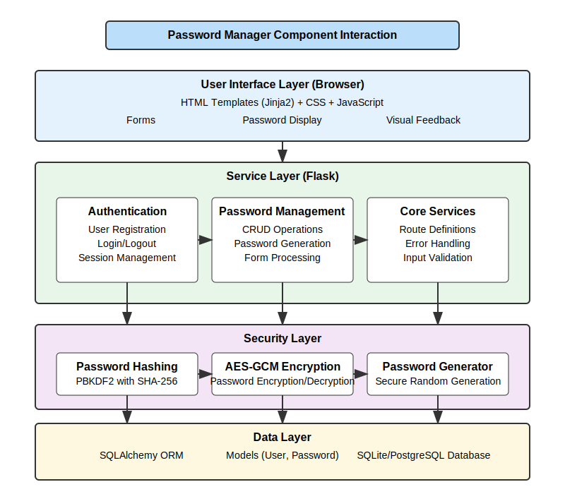
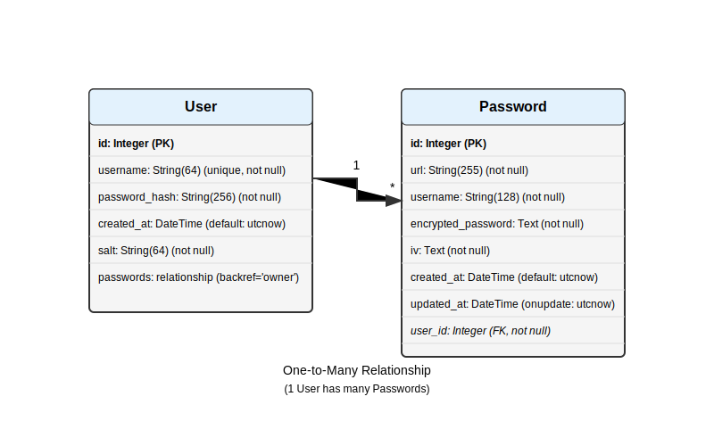
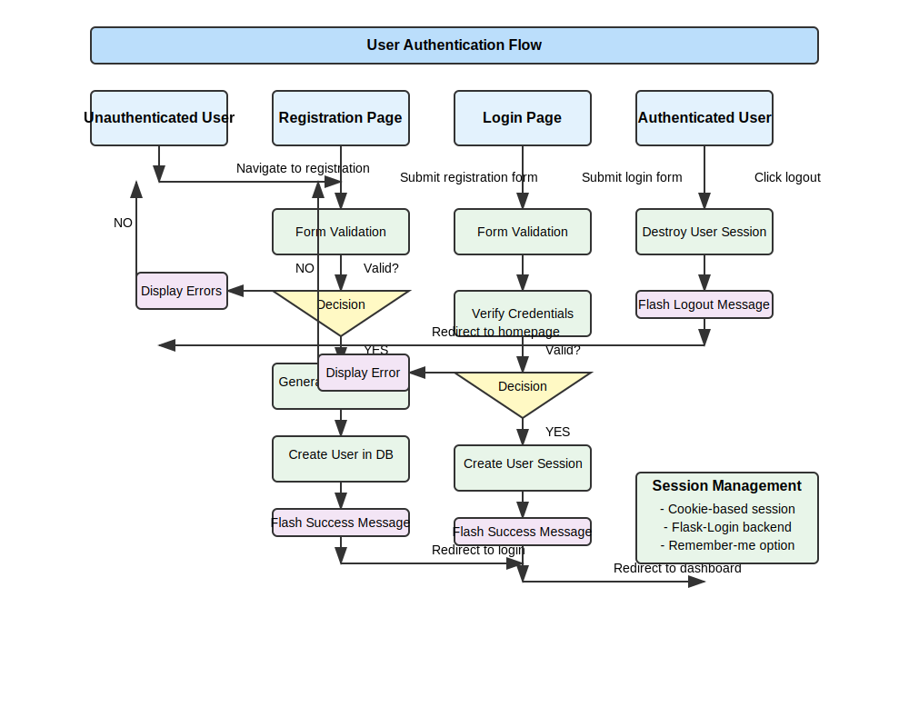
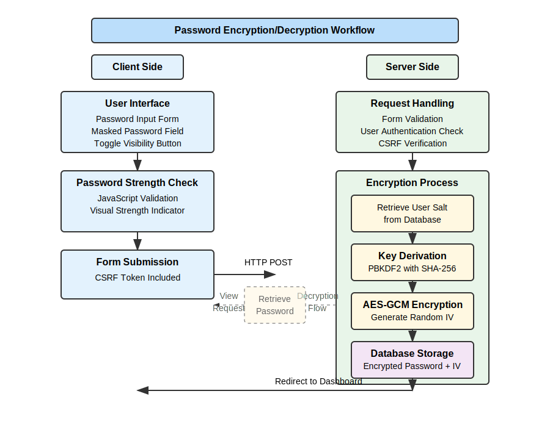
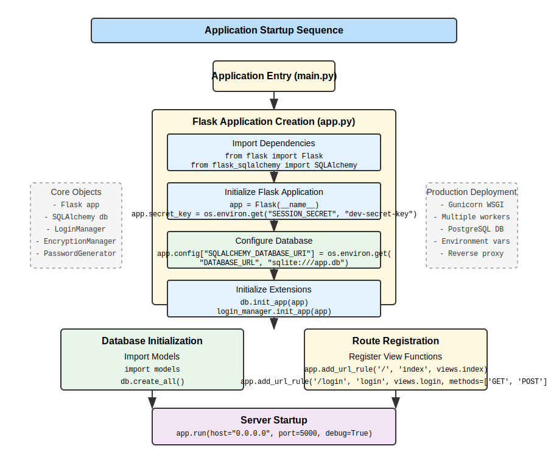

# Comprehensive Analysis of Secure Password Manager Application

**Date:** April 26, 2025  
**Author:** Analyst  
**Version:** 1.0

## Table of Contents

1. [Executive Summary](#executive-summary)
2. [Introduction](#introduction)
3. [Application Architecture](#application-architecture)
   1. [Overview](#architecture-overview)
   2. [Architectural Pattern](#architectural-pattern)
   3. [Component Interaction Diagram](#component-interaction-diagram)
   4. [Directory Structure](#directory-structure)
   5. [Design Principles Applied](#design-principles-applied)
4. [Technology Stack](#technology-stack)
   1. [Backend Technologies](#backend-technologies)
   2. [Frontend Technologies](#frontend-technologies)
   3. [Development Environment](#development-environment)
5. [Database Design](#database-design)
   1. [Entity Relationship Diagram](#entity-relationship-diagram)
   2. [Database Schema](#database-schema)
   3. [Data Models](#data-models)
   4. [Relationships](#relationships)
   5. [Database Configuration](#database-configuration)
6. [Authentication System](#authentication-system)
   1. [User Registration Process](#user-registration-process)
   2. [Login Mechanism](#login-mechanism)
   3. [Session Management](#session-management)
   4. [Password Hashing](#password-hashing)
   5. [Security Considerations](#authentication-security-considerations)
7. [Encryption Implementation](#encryption-implementation)
   1. [Encryption Algorithms Used](#encryption-algorithms-used)
   2. [Key Derivation Functions](#key-derivation-functions)
   3. [Salt Generation and Management](#salt-generation-and-management)
   4. [Encryption and Decryption Workflows](#encryption-and-decryption-workflows)
   5. [Security Analysis](#encryption-security-analysis)
8. [Password Generation System](#password-generation-system)
   1. [Password Generation Algorithm](#password-generation-algorithm)
   2. [Character Set Management](#character-set-management)
   3. [Password Strength Evaluation](#password-strength-evaluation)
   4. [Security Analysis](#generation-security-analysis)
9. [Frontend Implementation](#frontend-implementation)
   1. [Template System Overview](#template-system-overview)
   2. [User Interface Design](#user-interface-design)
   3. [Form Handling](#form-handling)
   4. [JavaScript Functionality](#javascript-functionality)
   5. [Responsive Design Aspects](#responsive-design-aspects)
10. [API Endpoints](#api-endpoints)
    1. [Endpoint Documentation](#endpoint-documentation)
    2. [Request/Response Formats](#request-response-formats)
    3. [Error Handling](#api-error-handling)
11. [Routing System](#routing-system)
    1. [URL Structure](#url-structure)
    2. [View Functions](#view-functions)
    3. [Access Control](#access-control)
12. [Security Analysis](#security-analysis)
    1. [Threat Model](#threat-model)
    2. [Vulnerability Assessment](#vulnerability-assessment)
    3. [Secure Coding Practices](#secure-coding-practices)
    4. [Data Protection Measures](#data-protection-measures)
13. [Performance Considerations](#performance-considerations)
    1. [Database Query Optimization](#database-query-optimization)
    2. [Caching Strategy](#caching-strategy)
    3. [Potential Bottlenecks](#potential-bottlenecks)
14. [Testing Approaches](#testing-approaches)
    1. [Unit Testing](#unit-testing)
    2. [Integration Testing](#integration-testing)
    3. [Security Testing](#security-testing)
15. [Deployment Strategy](#deployment-strategy)
    1. [Environment Configuration](#environment-configuration)
    2. [Database Migration](#database-migration)
    3. [Server Setup](#server-setup)
16. [Maintenance and Future Improvements](#maintenance-and-future-improvements)
    1. [Potential Feature Additions](#potential-feature-additions)
    2. [Code Refactoring Opportunities](#code-refactoring-opportunities)
    3. [Security Enhancement Roadmap](#security-enhancement-roadmap)
17. [Detailed Code Analysis](#detailed-code-analysis)
    1. [app.py Analysis](#app-py-analysis)
    2. [models.py Analysis](#models-py-analysis)
    3. [views.py Analysis](#views-py-analysis)
    4. [encryption.py Analysis](#encryption-py-analysis)
    5. [generator.py Analysis](#generator-py-analysis)
    6. [forms.py Analysis](#forms-py-analysis)
    7. [Frontend Templates Analysis](#frontend-templates-analysis)
    8. [JavaScript Analysis](#javascript-analysis)
18. [Appendices](#appendices)
    1. [Glossary of Terms](#glossary-of-terms)
    2. [References](#references)
    3. [Python Library Detail](#python-library-detail)
    4. [Flask Extensions Used](#flask-extensions-used)
    5. [Cryptography Concepts](#cryptography-concepts)

## Executive Summary

This document provides a comprehensive analysis of a Flask-based Secure Password Manager application. The application is designed to allow users to securely store, generate, and manage their passwords using modern encryption techniques. The analysis covers all aspects of the application including architecture, database design, encryption implementation, password generation, frontend implementation, security considerations, and detailed code examination.

The Password Manager implements industry-standard security practices including AES-256 encryption for password storage, PBKDF2 for key derivation, secure password generation, and proper authentication mechanisms. The application follows a typical Flask application structure with a clear separation of concerns between database models, view functions, forms, and templates.

This analysis aims to provide a thorough understanding of the application's design, implementation, and security considerations, serving as both documentation and a reference for future development or security audits.

## Introduction

Password management is a critical aspect of digital security in today's world. With the proliferation of online accounts, users need secure and convenient ways to store and manage their credentials. The Secure Password Manager application provides a solution to this problem by offering a web-based platform for users to securely store, generate, and manage their passwords.

The application is built using Python with Flask as the web framework, SQLAlchemy for database operations, and leverages modern cryptographic practices to ensure the security of stored passwords. This analysis explores the technical implementation, security considerations, and overall architecture of the application.

### Application Purpose and Goals

The primary purposes of the Secure Password Manager application are:

1. **Secure Password Storage:** Allow users to securely store passwords for various websites and services.
2. **Password Generation:** Provide a tool to generate strong, random passwords.
3. **Password Organization:** Help users organize and easily access their stored passwords.
4. **Data Protection:** Ensure that all sensitive data is properly encrypted and protected.
5. **User-Friendly Interface:** Offer a clean, intuitive interface for managing passwords.

## Application Architecture

### Architecture Overview

The Secure Password Manager follows a typical Flask application architecture, structured around the Model-View-Controller (MVC) pattern, although Flask doesn't strictly enforce this pattern. The application is organized into distinct components that handle specific aspects of functionality:

1. **Database Models (Model):** Defined in `models.py`, representing the data structure.
2. **View Functions (Controller):** Implemented in `views.py`, handling request processing and business logic.
3. **Templates (View):** HTML templates with Jinja2 templating for rendering the UI.
4. **Forms:** Defined in `forms.py` using Flask-WTF for form handling and validation.
5. **Utility Components:** Additional modules like `encryption.py` and `generator.py` for specific functionality.

### Architectural Pattern

The application primarily follows a layered architecture pattern:

1. **Presentation Layer:** Flask templates and static assets (HTML, CSS, JavaScript)
2. **Application Layer:** View functions, form handling, and business logic
3. **Domain Layer:** Core functionality including encryption and password generation
4. **Data Layer:** Database models and ORM (Object-Relational Mapping) via SQLAlchemy

This layered approach provides separation of concerns, making the codebase more maintainable and allowing components to evolve independently.

### Component Interaction Diagram

The following diagram illustrates the high-level components of the password manager application and how they interact with each other:



This diagram shows the layered architecture of the application, with:
- User interface layer (browser-based)
- Flask application layer containing multiple components:
  - UI components (templates, static assets)
  - Authentication services (login/registration)
  - Password management functionality
  - Core infrastructure (database access, form validation)
  - Security services (encryption, key derivation)
- Database layer (SQLite/PostgreSQL) for persistent storage

### Directory Structure

The application has a typical Flask project structure:

```
/
├── app.py                  # Application initialization
├── main.py                 # Application entry point
├── models.py               # Database models
├── views.py                # View functions and routes
├── forms.py                # Form definitions
├── encryption.py           # Encryption utilities
├── generator.py            # Password generation logic
├── static/                 # Static assets
│   ├── css/                # CSS stylesheets
│   │   ├── style.css       # Custom styling
│   │   └── bootstrap-...   # Bootstrap theme
│   ├── js/                 # JavaScript files
│   │   └── main.js         # Main JavaScript functionality
├── templates/              # HTML templates
│   ├── base.html           # Base template with layout
│   ├── index.html          # Home page
│   ├── login.html          # Login page
│   ├── register.html       # Registration page
│   ├── dashboard.html      # User dashboard
│   ├── add_password.html   # Add password form
│   ├── view_password.html  # View password details
│   ├── edit_password.html  # Edit password form
│   └── generate_password.html # Password generator
└── requirements.txt        # Python dependencies
```

### Design Principles Applied

The application demonstrates several key design principles:

1. **Separation of Concerns:** Different aspects of functionality are separated into different modules.
2. **Don't Repeat Yourself (DRY):** Code reuse is evident in templates and utility functions.
3. **Single Responsibility Principle:** Each class and module has a clear, focused purpose.
4. **Security by Design:** Security considerations are fundamental to the architecture.
5. **Progressive Enhancement:** Basic functionality works without JavaScript, but JavaScript enhances the user experience.

## Technology Stack

### Backend Technologies

The application uses a Python-based stack with Flask as the web framework:

1. **Python:** The core programming language (version required: 3.6+)
2. **Flask:** Web framework providing routing, template rendering, and request handling
3. **SQLAlchemy:** ORM for database interactions
4. **Flask-Login:** Extension for user authentication and session management
5. **Flask-WTF:** Extension for form handling and validation
6. **Cryptography:** Library for encryption and cryptographic operations
7. **Werkzeug:** WSGI utility library, used for password hashing and security utilities

### Frontend Technologies

The frontend uses a combination of HTML, CSS, and JavaScript with Bootstrap for styling:

1. **HTML5:** For structure and content
2. **CSS3:** For styling, primarily via Bootstrap
3. **JavaScript:** For client-side interactivity
4. **Bootstrap:** CSS framework for responsive design
5. **Font Awesome:** Icon library for UI elements
6. **Jinja2:** Templating engine for dynamic HTML generation

### Development Environment

The application is configured to run in a typical Python web application environment:

1. **Gunicorn:** WSGI HTTP server for production deployment
2. **SQLite/PostgreSQL:** Database options (configurable via environment variables)
3. **Environment Variables:** Used for configuration management

## Database Design

### Entity Relationship Diagram

The database has a relatively simple structure with two main entities organized in a one-to-many relationship:



The diagram shows the two primary entities in the system and their attributes:

1. **User Entity**: Stores user account information and authentication data
   - Primary key: id (Integer)
   - Username (unique, not null)
   - Password hash (not null)
   - Salt for encryption (not null)
   - Creation timestamp

2. **Password Entity**: Stores encrypted password entries
   - Primary key: id (Integer)
   - Service URL/name (not null)
   - Username for the service (not null)
   - Encrypted password data (not null)
   - Initialization vector for encryption (not null)
   - Creation and update timestamps
   - Foreign key: user_id linking to User (not null)

The diagram shows a one-to-many relationship between the User entity and the Password entity, indicating that one user can have multiple password entries.

### Database Schema

The database schema is implemented using SQLAlchemy's ORM in the `models.py` file:

1. **User Table:**
   - `id` (Integer, Primary Key): Unique identifier for the user
   - `username` (String): Unique username for authentication
   - `password_hash` (String): Hashed master password
   - `created_at` (DateTime): Account creation timestamp
   - `salt` (String): Cryptographic salt for key derivation

2. **Password Table:**
   - `id` (Integer, Primary Key): Unique identifier for the password entry
   - `url` (String): Website or service name
   - `username` (String): Username or email for the service
   - `encrypted_password` (Text): Encrypted password (base64 encoded)
   - `iv` (Text): Initialization vector for encryption (base64 encoded)
   - `created_at` (DateTime): Entry creation timestamp
   - `updated_at` (DateTime): Entry update timestamp
   - `user_id` (Integer, Foreign Key): Reference to User.id
   - `notes` (Text): Optional notes for the password entry

### Data Models

The application defines two main data models in `models.py`:

1. **User Model:**
   ```python
   class User(UserMixin, db.Model):
       """User model for authentication"""
       id = db.Column(db.Integer, primary_key=True)
       username = db.Column(db.String(64), unique=True, nullable=False)
       password_hash = db.Column(db.String(256), nullable=False)
       created_at = db.Column(db.DateTime, default=datetime.utcnow)
       salt = db.Column(db.String(64), nullable=False)
       passwords = db.relationship('Password', backref='owner', lazy=True, cascade='all, delete-orphan')
   ```

   The User model extends `UserMixin` from Flask-Login, which provides default implementations for the methods that Flask-Login expects user objects to have.

2. **Password Model:**
   ```python
   class Password(db.Model):
       """Password model for storing encrypted password entries"""
       id = db.Column(db.Integer, primary_key=True)
       url = db.Column(db.String(255), nullable=False)
       username = db.Column(db.String(128), nullable=False)
       encrypted_password = db.Column(db.Text, nullable=False)
       iv = db.Column(db.Text, nullable=False)
       created_at = db.Column(db.DateTime, default=datetime.utcnow)
       updated_at = db.Column(db.DateTime, default=datetime.utcnow, onupdate=datetime.utcnow)
       user_id = db.Column(db.Integer, db.ForeignKey('user.id'), nullable=False)
       notes = db.Column(db.Text)
   ```

### Relationships

The application defines a one-to-many relationship between User and Password:

1. A User can have multiple Password entries (one-to-many).
2. Each Password entry belongs to exactly one User (many-to-one).

The relationship is defined in the User model:
```python
passwords = db.relationship('Password', backref='owner', lazy=True, cascade='all, delete-orphan')
```

This relationship includes:
- `backref='owner'`: Creates a virtual column on the Password model to reference the associated User
- `lazy=True`: Specifies that the relationship should be loaded only when accessed
- `cascade='all, delete-orphan'`: Ensures that when a User is deleted, all associated Password entries are also deleted

### Database Configuration

Database configuration is handled in `app.py` with support for both SQLite and PostgreSQL:

```python
app.config["SQLALCHEMY_DATABASE_URI"] = os.environ.get("DATABASE_URL", "sqlite:///app.db")
app.config["SQLALCHEMY_ENGINE_OPTIONS"] = {
    "pool_recycle": 300,
    "pool_pre_ping": True,
}
app.config["SQLALCHEMY_TRACK_MODIFICATIONS"] = False
```

Key features of the configuration:
1. **URI Configuration:** Primarily uses environment variables, with SQLite as a fallback
2. **Connection Pooling:** Configured with recycling to prevent stale connections
3. **Pool Pre-Ping:** Helps detect disconnected connections before use
4. **Track Modifications:** Disabled to improve performance

## Authentication System

### User Registration Process

The registration process is implemented in `views.py` in the `register()` function:

1. User submits the registration form with username and password
2. The form is validated, including checking for existing usernames
3. A cryptographic salt is generated for the user
4. The password is hashed using Werkzeug's `generate_password_hash`
5. A new User record is created with the username, hashed password, and salt
6. The user is redirected to the login page

### Authentication Flow Diagram

The following diagram illustrates the complete authentication flow in the application, including registration, login, session management, and logout processes:



This comprehensive diagram shows the user journey through the authentication system:

1. **Registration Process**:
   - Form submission and validation
   - Error handling for invalid inputs
   - Salt generation and password hashing
   - User creation in database
   - Success notification and redirection to login

2. **Login Process**:
   - Credential verification
   - Session creation with Flask-Login
   - Redirection to dashboard upon success

3. **Session Management**:
   - Cookie-based user sessions
   - Remember-me functionality
   - Secure session handling

4. **Logout Process**:
   - Session destruction
   - Redirection to homepage

Key code snippet:
```python
@app.route('/register', methods=['GET', 'POST'])
def register():
    """User registration route."""
    if current_user.is_authenticated:
        return redirect(url_for('dashboard'))
    
    form = RegistrationForm()
    if form.validate_on_submit():
        # Generate salt for master key
        salt = encryption_manager.generate_salt().hex()
        
        # Create new user
        user = User(
            username=form.username.data,
            password_hash=generate_password_hash(form.password.data),
            salt=salt
        )
        
        db.session.add(user)
        db.session.commit()
        
        flash('Registration successful! Please log in.', 'success')
        return redirect(url_for('login'))
    
    return render_template('register.html', form=form)
```

### Login Mechanism

The login mechanism is implemented in `views.py` in the `login()` function:

1. User submits the login form with username and password
2. The username is used to retrieve the user record from the database
3. The submitted password is verified against the stored hash using Werkzeug's `check_password_hash`
4. If verified, Flask-Login's `login_user()` function is called to create a user session
5. The user is redirected to the dashboard or the originally requested page

Key code snippet:
```python
@app.route('/login', methods=['GET', 'POST'])
def login():
    """User login route."""
    if current_user.is_authenticated:
        return redirect(url_for('dashboard'))
    
    form = LoginForm()
    if form.validate_on_submit():
        user = User.query.filter_by(username=form.username.data).first()
        
        if user and check_password_hash(user.password_hash, form.password.data):
            login_user(user, remember=form.remember.data)
            flash('Login successful!', 'success')
            
            next_page = request.args.get('next')
            if not next_page or not next_page.startswith('/'):
                next_page = url_for('dashboard')
            
            return redirect(next_page)
        else:
            flash('Login failed. Please check your username and password.', 'danger')
    
    return render_template('login.html', form=form)
```

### Session Management

Session management is handled by Flask-Login:

1. **Configuration in app.py:**
   ```python
   login_manager = LoginManager()
   login_manager.init_app(app)
   login_manager.login_view = 'login'
   login_manager.login_message_category = 'info'
   ```

2. **User Loader Function:**
   ```python
   @login_manager.user_loader
   def load_user(user_id):
       from models import User
       return User.query.get(int(user_id))
   ```

3. **Session Security:**
   - Sessions are secured with a secret key: `app.secret_key = os.environ.get("SESSION_SECRET", "dev-secret-key")`
   - The `remember` parameter in `login_user()` controls persistent sessions
   - Logout is handled by Flask-Login's `logout_user()` function

### Password Hashing

The application uses two different password handling mechanisms:

1. **Master Password Hashing (for authentication):**
   - Uses Werkzeug's `generate_password_hash` and `check_password_hash` functions
   - These functions use PBKDF2 with SHA-256, providing strong protection against brute force and rainbow table attacks
   - Used for verifying the user's master password during login

2. **Custom Password Hashing (in EncryptionManager):**
   - Implemented in `encryption.py` using Python's `hashlib.pbkdf2_hmac`
   - Used for key derivation and internal verification
   - Configurable iteration count (set to 100,000) for adequate security

### Authentication Security Considerations

1. **Brute Force Protection:**
   - Password hashing with PBKDF2 and high iteration count slows down brute force attempts
   - No explicit rate limiting is implemented, which could be a security improvement

2. **Password Requirements:**
   - Minimum 8 characters required for the master password
   - Client-side password strength evaluation provides guidance to users
   - No strict complexity requirements are enforced server-side

3. **Session Security:**
   - Sessions are bound to the user's browser through cookies
   - Session fixation protection through Flask's session management
   - CSRF protection provided by Flask-WTF's CSRF tokens

4. **Authentication Feedback:**
   - Generic error messages avoid leaking information about valid usernames

## Encryption Implementation

### Encryption Algorithms Used

The application employs modern, strong encryption algorithms for protecting sensitive data:

1. **AES-GCM (Galois/Counter Mode):**
   - Used for encrypting and decrypting passwords
   - A symmetric encryption algorithm with authenticated encryption
   - Provides both confidentiality and integrity protection
   - Uses 256-bit keys for encryption, providing strong security

2. **PBKDF2 (Password-Based Key Derivation Function 2):**
   - Used for deriving encryption keys from the user's master password
   - Applies a pseudorandom function (SHA-256) with many iterations (100,000)
   - Helps protect against brute-force attacks by increasing computational cost

### Encryption Architecture Diagram

The following diagram illustrates the encryption and decryption processes used in the password manager:



This diagram shows the complete encryption workflow:

1. **Client-Side Components**:
   - User interface for password input with visibility toggle
   - Password strength evaluation with visual indicators
   - Form submission with CSRF protection

2. **Server-Side Components**:
   - Key derivation using PBKDF2 with user's master password and salt
   - AES-GCM authenticated encryption with random IV generation
   - Base64 encoding for database storage
   - Secure storage in the Password model
   - Decryption process with authentication verification

The encryption architecture provides strong security through:
- Authenticated encryption (both confidentiality and integrity)
- Individual encryption keys derived from each user's master password
- Unique initialization vectors (IV) for each password entry
- High iteration count (100,000) for key derivation to resist brute force attacks

### Key Derivation Functions

The application derives encryption keys from the user's master password using PBKDF2:

```python
def derive_key(self, password: str, salt: bytes) -> bytes:
    """
    Derive an encryption key from a password and salt using PBKDF2.
    
    Args:
        password: Master password
        salt: Random salt
        
    Returns:
        bytes: Derived key
    """
    kdf = PBKDF2HMAC(
        algorithm=hashes.SHA256(),
        length=self.key_length,
        salt=salt,
        iterations=self.iterations,
        backend=default_backend()
    )
    return kdf.derive(password.encode())
```

Key aspects of the implementation:
1. Uses SHA-256 as the pseudorandom function
2. Derives a 32-byte (256-bit) key
3. Uses a unique salt for each user
4. Applies 100,000 iterations to increase computational cost

### Salt Generation and Management

Each user has a unique cryptographic salt for key derivation:

1. **Salt Generation:**
   ```python
   def generate_salt(self) -> bytes:
       """
       Generate a random salt for key derivation.
       
       Returns:
           bytes: Random salt
       """
       return os.urandom(self.salt_length)
   ```

2. **Salt Storage:**
   - Salts are stored in plaintext in the User table
   - Each user has a unique salt, stored as a hexadecimal string
   - The salt is generated during user registration

3. **Salt Usage:**
   - During password operations, the salt is retrieved from the user record
   - The salt is converted from a hex string back to bytes
   - The salt is used with the master password to derive the encryption key

### Encryption and Decryption Workflows

The application uses a consistent workflow for encryption and decryption:

1. **Encryption Workflow:**
   ```python
   def encrypt(self, plaintext: str, key: bytes) -> Tuple[str, str]:
       """
       Encrypt plaintext using AES-GCM.
       
       Args:
           plaintext: Text to encrypt
           key: Encryption key
           
       Returns:
           Tuple[str, str]: Base64-encoded ciphertext and IV
       """
       # Generate a random nonce (IV)
       iv = os.urandom(12)  # 96 bits, recommended for GCM
       
       # Create an AES-GCM cipher with the provided key
       aesgcm = AESGCM(key)
       
       # Encrypt the plaintext
       ciphertext = aesgcm.encrypt(iv, plaintext.encode('utf-8'), None)
       
       # Return the base64-encoded ciphertext and IV
       return base64.b64encode(ciphertext).decode('utf-8'), base64.b64encode(iv).decode('utf-8')
   ```

   - Generate a random 96-bit Initialization Vector (IV)
   - Create an AES-GCM cipher object with the derived key
   - Encrypt the plaintext using the cipher
   - Encode both the ciphertext and IV in base64 for storage

2. **Decryption Workflow:**
   ```python
   def decrypt(self, ciphertext_b64: str, iv_b64: str, key: bytes) -> str:
       """
       Decrypt ciphertext using AES-GCM.
       
       Args:
           ciphertext_b64: Base64-encoded ciphertext
           iv_b64: Base64-encoded IV
           key: Decryption key
           
       Returns:
           str: Decrypted plaintext
           
       Raises:
           Exception: If decryption fails
       """
       try:
           # Decode the base64 ciphertext and IV
           ciphertext = base64.b64decode(ciphertext_b64)
           iv = base64.b64decode(iv_b64)
           
           # Create an AES-GCM cipher with the provided key
           aesgcm = AESGCM(key)
           
           # Decrypt the ciphertext
           plaintext = aesgcm.decrypt(iv, ciphertext, None)
           
           # Return the plaintext string
           return plaintext.decode('utf-8')
       except Exception as e:
           raise Exception(f"Decryption failed: {str(e)}")
   ```

   - Decode the base64-encoded ciphertext and IV
   - Create an AES-GCM cipher object with the derived key
   - Decrypt the ciphertext using the cipher and IV
   - Return the decrypted plaintext as a string

3. **Key Usage Workflow:**
   When storing or retrieving passwords, the application:
   - Retrieves the user's salt from the database
   - Derives the encryption key using the master password and salt
   - Uses the key for encryption or decryption operations

### Encryption Security Analysis

The encryption implementation uses modern, secure algorithms and practices:

1. **Strengths:**
   - AES-GCM provides authenticated encryption (both confidentiality and integrity)
   - 256-bit keys provide strong security against brute-force attacks
   - Unique IV for each encryption operation prevents patterns across ciphertexts
   - PBKDF2 with high iteration count protects against weak master passwords
   - Unique salt per user prevents rainbow table attacks

2. **Considerations:**
   - The security of the system depends on the strength of the master password
   - The master password hash is used as input to key derivation, which is unusual
   - No key rotation mechanism is implemented

3. **Encryption Dependencies:**
   - The implementation relies on the `cryptography` Python package
   - Uses secure, well-reviewed implementations of cryptographic primitives

## Password Generation System

### Password Generation System Diagram

The password generator uses a sophisticated system to create and evaluate secure passwords:


This diagram illustrates the complete password generation workflow:

1. **User Input Options**:
   - Password length configuration (8-64 characters)
   - Character set selection through checkboxes:
     - Lowercase letters (always included)
     - Uppercase letters (optional)
     - Digits (optional)
     - Special symbols (optional)

2. **Password Generation Process**:
   - Input validation to ensure minimum length and character set selection
   - Character set building based on user preferences
   - Secure random generation using Python's `secrets` module
   - Character set guarantee to ensure password diversity

3. **Password Strength Evaluation**:
   - Length-based scoring (longer passwords = higher score)
   - Character variety assessment
   - Pattern detection for weak sequences
   - Classification into strength categories (Weak, Medium, Strong, Very Strong)

The implementation uses cryptographically secure random number generation to provide high-quality passwords suitable for securing sensitive information.

### Password Generation Algorithm

The password generator is implemented in `generator.py` and provides a secure mechanism for creating random passwords:

```python
def generate_password(self, length: int = 16, use_uppercase: bool = True,
                     use_digits: bool = True, use_symbols: bool = True) -> str:
    """
    Generate a secure random password with the specified characteristics.
    
    Args:
        length: Length of the password (default: 16)
        use_uppercase: Include uppercase letters (default: True)
        use_digits: Include digits (default: True)
        use_symbols: Include special symbols (default: True)
        
    Returns:
        str: Generated password
    
    Raises:
        ValueError: If length is too short or no character sets are selected
    """
    if length < 8:
        raise ValueError("Password length must be at least 8 characters")
    
    # Build the character set based on selected options
    charset = self.lowercase_letters  # Always include lowercase
    
    if use_uppercase:
        charset += self.uppercase_letters
    if use_digits:
        charset += self.digits
    if use_symbols:
        charset += self.symbols
    
    # Ensure we have characters to choose from
    if not charset:
        raise ValueError("At least one character set must be selected")
    
    # Generate password
    password = ""
    for _ in range(length):
        password += secrets.choice(charset)
    
    # Ensure the password contains at least one character from each selected set
    # This avoids the unlikely case where, for example, no uppercase letters
    # are included despite them being allowed
    
    # Always include at least one lowercase
    if not any(c in self.lowercase_letters for c in password):
        # Replace a random character with a lowercase letter
        password = self._replace_random_char(password, self.lowercase_letters)
    
    if use_uppercase and not any(c in self.uppercase_letters for c in password):
        password = self._replace_random_char(password, self.uppercase_letters)
        
    if use_digits and not any(c in self.digits for c in password):
        password = self._replace_random_char(password, self.digits)
        
    if use_symbols and not any(c in self.symbols for c in password):
        password = self._replace_random_char(password, self.symbols)
    
    return password
```

Key aspects of the algorithm:
1. Uses Python's `secrets` module for cryptographically strong random number generation
2. Allows customization of password characteristics (length, character sets)
3. Ensures inclusion of at least one character from each selected character set
4. Enforces a minimum password length of 8 characters

### Character Set Management

The password generator defines and manages different character sets:

```python
def __init__(self):
    """Initialize the password generator."""
    self.lowercase_letters = string.ascii_lowercase
    self.uppercase_letters = string.ascii_uppercase
    self.digits = string.digits
    self.symbols = "!@#$%^&*()-_=+[]{}|;:,.<>?/~"
```

1. **Lowercase Letters:** a-z
2. **Uppercase Letters:** A-Z
3. **Digits:** 0-9
4. **Symbols:** A set of common special characters

The character sets are combined based on user preferences when generating passwords.

### Password Strength Evaluation

The password generator includes a method to evaluate password strength:

```python
def evaluate_strength(self, password: str) -> str:
    """
    Evaluate the strength of a password.
    
    Args:
        password: Password to evaluate
        
    Returns:
        str: Password strength rating ('Weak', 'Medium', 'Strong', or 'Very Strong')
    """
    # Calculate score based on various factors
    score = 0
    
    # Length
    if len(password) >= 12:
        score += 3
    elif len(password) >= 10:
        score += 2
    elif len(password) >= 8:
        score += 1
    
    # Character variety
    if re.search(r'[a-z]', password):
        score += 1
    if re.search(r'[A-Z]', password):
        score += 1
    if re.search(r'[0-9]', password):
        score += 1
    if re.search(r'[^a-zA-Z0-9]', password):
        score += 1
    
    # Check for common patterns that weaken passwords
    # Repeated characters
    if re.search(r'(.)\1{2,}', password):  # Same character repeated 3+ times
        score -= 1
    
    # Sequential characters
    if any(seq in password.lower() for seq in [
        'abcdef', 'ghijkl', 'mnopqr', 'stuvwx', 'xyz',
        '123456', '789012', '654321'
    ]):
        score -= 1
    
    # Convert score to rating
    if score <= 2:
        return "Weak"
    elif score <= 4:
        return "Medium"
    elif score <= 6:
        return "Strong"
    else:
        return "Very Strong"
```

The strength evaluation considers:
1. **Password Length:** Longer passwords receive higher scores
2. **Character Variety:** Use of different character types (lowercase, uppercase, digits, symbols)
3. **Pattern Detection:** Penalties for repeated or sequential characters
4. **Scoring System:** Translates numerical scores into qualitative ratings

### Generation Security Analysis

The password generation system follows best practices for security:

1. **Strengths:**
   - Uses cryptographically secure random number generation (`secrets` module)
   - Produces passwords with high entropy when all character sets are used
   - Ensures minimum length and character set requirements
   - Evaluates password strength to guide users

2. **Considerations:**
   - Special character set is predefined and not configurable
   - No option to exclude ambiguous characters (like 1, l, I, 0, O)
   - No word-based or memorable password generation options

3. **Random Number Generation:**
   - The `secrets` module is appropriate for cryptographic purposes
   - Provides better security than Python's standard `random` module

## Frontend Implementation

### Template System Overview

The application uses Flask's Jinja2 templating engine for rendering HTML:

1. **Base Template:** `base.html` provides the common layout and includes:
   - Responsive Meta Tags
   - CSS Stylesheets (Bootstrap and custom)
   - Navigation Bar
   - Flash Message Display
   - Footer
   - JavaScript Includes

2. **Template Inheritance:** All page templates extend the base template:
   ```html
   
   
   Page Title
   
   
   <!-- Page-specific content here -->
   
   ```

3. **Template Context:** View functions provide context data for templates:
   ```python
   return render_template('dashboard.html', passwords=passwords)
   ```

### User Interface Design

The UI follows a clean, modern design using Bootstrap's dark theme:

1. **Color Scheme:**
   - Dark background (`bg-dark`) for main content
   - Primary blue accent color for main actions
   - Success green for add actions
   - Warning yellow for edit actions
   - Danger red for delete actions

2. **Layout Components:**
   - Responsive navigation bar
   - Card-based content containers
   - Grid system for responsive layouts
   - Form groups for input organization

3. **Interactive Elements:**
   - Buttons with icon and text labels
   - Toggle switches for password visibility
   - Form validation feedback
   - Flash messages for system feedback

### Form Handling

Forms are defined using Flask-WTF and rendered in templates:

1. **Form Definition (forms.py):**
   ```python
   class AddPasswordForm(FlaskForm):
       url = StringField('URL or Service Name', validators=[DataRequired(), Length(max=255)])
       username = StringField('Username or Email', validators=[DataRequired(), Length(max=128)])
       password = PasswordField('Password', validators=[DataRequired()])
       notes = TextAreaField('Notes', validators=[Optional()])
       
       # Password generation options
       generate_password = BooleanField('Generate Password', default=False)
       password_length = IntegerField('Password Length', validators=[Optional(), NumberRange(min=8, max=64)], default=16)
       include_uppercase = BooleanField('Include Uppercase Letters', default=True)
       include_digits = BooleanField('Include Digits', default=True)
       include_symbols = BooleanField('Include Special Characters', default=True)
       
       submit = SubmitField('Save Password')
   ```

2. **Form Rendering (template):**
   ```html
   <form method="POST" action="{{ url_for('add_password') }}">
       {{ form.hidden_tag() }}
       
       <div class="mb-3">
           <label for="{{ form.url.id }}" class="form-label">URL or Service Name</label>
           {{ form.url(class="form-control", placeholder="e.g., example.com or Banking") }}
           
               <div class="text-danger small">{{ error }}</div>
           
       </div>
       
       <!-- Additional form fields -->
       
       <div class="d-flex justify-content-between">
           <a href="{{ url_for('dashboard') }}" class="btn btn-outline-secondary">
               <i class="fas fa-arrow-left me-1"></i>Cancel
           </a>
           {{ form.submit(class="btn btn-success") }}
       </div>
   </form>
   ```

3. **Form Processing (views.py):**
   ```python
   @app.route('/password/add', methods=['GET', 'POST'])
   @login_required
   def add_password():
       """Add a new password entry."""
       form = AddPasswordForm()
       
       if form.validate_on_submit():
           # Process form data
           # ...
           
           flash('Password added successfully!', 'success')
           return redirect(url_for('dashboard'))
       
       return render_template('add_password.html', form=form)
   ```

### JavaScript Functionality

The application includes JavaScript enhancements in `static/js/main.js`:

1. **Password Visibility Toggle:**
   ```javascript
   const togglePasswordBtns = document.querySelectorAll('.toggle-password');
   togglePasswordBtns.forEach(function(btn) {
       btn.addEventListener('click', function() {
           const targetId = this.getAttribute('data-target');
           const passwordField = document.getElementById(targetId);
           
           if (passwordField.type === 'password') {
               passwordField.type = 'text';
               this.innerHTML = '<i class="fa fa-eye-slash"></i>';
           } else {
               passwordField.type = 'password';
               this.innerHTML = '<i class="fa fa-eye"></i>';
           }
       });
   });
   ```

2. **Copy to Clipboard:**
   ```javascript
   const copyBtns = document.querySelectorAll('.copy-btn');
   copyBtns.forEach(function(btn) {
       btn.addEventListener('click', function() {
           const textToCopy = this.getAttribute('data-clipboard-text');
           // Copy to clipboard implementation
           // ...
       });
   });
   ```

3. **Password Generation Interface:**
   ```javascript
   if (generatePasswordBtn && passwordInput) {
       generatePasswordBtn.addEventListener('click', function(e) {
           e.preventDefault();
           
           const length = parseInt(document.querySelector('input[name="password_length"]').value);
           const uppercase = document.querySelector('input[name="include_uppercase"]').checked;
           const digits = document.querySelector('input[name="include_digits"]').checked;
           const symbols = document.querySelector('input[name="include_symbols"]').checked;
           
           // AJAX call to generate password
           fetch('/api/generate-password', {
               method: 'POST',
               headers: {
                   'Content-Type': 'application/json',
               },
               body: JSON.stringify({
                   length: length,
                   uppercase: uppercase,
                   digits: digits,
                   symbols: symbols
               }),
           })
           .then(response => response.json())
           .then(data => {
               if (data.password) {
                   passwordInput.value = data.password;
                   // Additional UI updates
                   // ...
               }
           })
           .catch(error => {
               console.error('Error generating password:', error);
           });
       });
   }
   ```

4. **Password Strength Evaluation:**
   ```javascript
   if (passwordInput && strengthIndicator) {
       passwordInput.addEventListener('input', async function() {
           const password = this.value;
           
           if (password.length > 0) {
               // Client-side password strength evaluation
               // ...
               
               // Update the indicator text and color
               strengthIndicator.textContent = strength;
               strengthIndicator.className = 'strength-' + strength.toLowerCase().replace(' ', '-');
           } else {
               strengthIndicator.textContent = '';
           }
       });
   }
   ```

### Responsive Design Aspects

The application uses Bootstrap for responsive design:

1. **Viewport Configuration:**
   ```html
   <meta name="viewport" content="width=device-width, initial-scale=1.0">
   ```

2. **Grid System:**
   ```html
   <div class="row">
       <div class="col-md-6">
           <!-- Content for medium and larger screens (half width) -->
           <!-- On small screens, takes full width -->
       </div>
       <div class="col-md-6">
           <!-- Content for medium and larger screens (half width) -->
           <!-- On small screens, takes full width -->
       </div>
   </div>
   ```

3. **Responsive Card Layout:**
   ```html
   <div class="row row-cols-1 row-cols-md-2 row-cols-lg-3 g-4">
       
       <div class="col">
           <div class="card password-card h-100 bg-dark">
               <!-- Card content -->
           </div>
       </div>
       
   </div>
   ```

4. **Responsive Navigation:**
   ```html
   <nav class="navbar navbar-expand-lg navbar-dark bg-dark mb-4">
       <!-- Navbar content -->
       <button class="navbar-toggler" type="button" data-bs-toggle="collapse" data-bs-target="#navbarNav">
           <span class="navbar-toggler-icon"></span>
       </button>
       <div class="collapse navbar-collapse" id="navbarNav">
           <!-- Navbar items -->
       </div>
   </nav>
   ```

## API Endpoints

### Endpoint Documentation

The application provides a limited set of API endpoints:

1. **Generate Password API:**
   - URL: `/api/generate-password`
   - Method: POST
   - Purpose: Generate a password with specified characteristics
   - Authentication: Requires user login
   - Request Body: JSON with password generation parameters
   - Response: JSON with generated password and strength rating

```python
@app.route('/api/generate-password', methods=['POST'])
@login_required
def api_generate_password():
    """API endpoint to generate a secure password."""
    data = request.get_json()
    
    try:
        length = int(data.get('length', 16))
        use_uppercase = data.get('uppercase', True)
        use_digits = data.get('digits', True)
        use_symbols = data.get('symbols', True)
        
        generated_password = password_generator.generate_password(
            length=length,
            use_uppercase=use_uppercase,
            use_digits=use_digits,
            use_symbols=use_symbols
        )
        
        return jsonify({
            'password': generated_password,
            'strength': password_generator.evaluate_strength(generated_password)
        })
    except Exception as e:
        return jsonify({'error': str(e)}), 400
```

### Request/Response Formats

The API uses JSON for both request and response data:

1. **Generate Password Request:**
   ```json
   {
     "length": 16,
     "uppercase": true,
     "digits": true,
     "symbols": true
   }
   ```

2. **Generate Password Response (Success):**
   ```json
   {
     "password": "aB3$cD5&eF7*gH9",
     "strength": "Very Strong"
   }
   ```

3. **Generate Password Response (Error):**
   ```json
   {
     "error": "Password length must be at least 8 characters"
   }
   ```

### API Error Handling

Error handling in the API is straightforward:

1. **Try-Except Pattern:**
   ```python
   try:
       # API operation
       # ...
       return jsonify(result)
   except Exception as e:
       return jsonify({'error': str(e)}), 400
   ```

2. **HTTP Status Codes:**
   - 200 OK: Successful operation
   - 400 Bad Request: Client-side error (invalid parameters)
   - 401 Unauthorized: Authentication required (handled by Flask-Login)

3. **Error Response Format:**
   ```json
   {
     "error": "Description of the error"
   }
   ```

## Routing System

### URL Structure

The application uses a logical URL structure:

1. **Authentication Routes:**
   - `/register`: User registration
   - `/login`: User login
   - `/logout`: User logout

2. **Dashboard:**
   - `/dashboard`: Main user dashboard showing all passwords

3. **Password Management:**
   - `/password/add`: Add a new password
   - `/password/<int:id>`: View a specific password
   - `/password/edit/<int:id>`: Edit a password
   - `/password/delete/<int:id>`: Delete a password

4. **Utility:**
   - `/generate-password`: Password generator tool
   - `/api/generate-password`: Password generation API

### View Functions

Each route is mapped to a view function in `views.py`:

1. **Route Registration in app.py:**
   ```python
   app.add_url_rule('/', 'index', views.index)
   app.add_url_rule('/register', 'register', views.register, methods=['GET', 'POST'])
   app.add_url_rule('/login', 'login', views.login, methods=['GET', 'POST'])
   app.add_url_rule('/logout', 'logout', views.logout)
   app.add_url_rule('/dashboard', 'dashboard', views.dashboard)
   app.add_url_rule('/add-password', 'add_password', views.add_password, methods=['GET', 'POST'])
   app.add_url_rule('/password/<int:id>', 'view_password', views.view_password, methods=['GET', 'POST'])
   app.add_url_rule('/generate-password', 'generate_password', views.generate_password, methods=['GET', 'POST'])
   app.add_url_rule('/password/edit/<int:id>', 'edit_password', views.edit_password, methods=['GET', 'POST'])
   app.add_url_rule('/password/delete/<int:id>', 'delete_password', views.delete_password)
   ```

2. **Common View Function Pattern:**
   ```python
   @login_required  # For protected routes
   def route_function():
       # Handle GET request (display form)
       if request.method == 'GET':
           # Prepare form or data
           # ...
           return render_template('template.html', form=form)
       
       # Handle POST request (process form)
       if form.validate_on_submit():
           # Process form data
           # ...
           flash('Success message', 'success')
           return redirect(url_for('next_route'))
       
       # Form validation failed
       return render_template('template.html', form=form)
   ```

### Access Control

Access control is implemented using Flask-Login:

1. **Login Required Decorator:**
   ```python
   @login_required
   def protected_route():
       # Only accessible to authenticated users
       # ...
   ```

2. **Ownership Verification:**
   ```python
   @login_required
   def view_password(id):
       password_entry = Password.query.get_or_404(id)
       
       # Ensure user owns this password
       if password_entry.user_id != current_user.id:
           flash('Access denied', 'danger')
           return redirect(url_for('dashboard'))
       
       # Continue with authorized access
       # ...
   ```

3. **Authentication State Checks:**
   ```python
   def register():
       # Redirect already authenticated users
       if current_user.is_authenticated:
           return redirect(url_for('dashboard'))
       
       # Continue with registration for unauthenticated users
       # ...
   ```

## Security Analysis

### Threat Model

The application's threat model considers several key risks:

1. **Unauthorized Access to Stored Passwords:**
   - Mitigated by encryption of all stored passwords
   - Each user's passwords are encrypted with a key derived from their master password
   - The master password is never stored directly

2. **Database Compromise:**
   - Mitigated by storing only encrypted password data
   - Master passwords are stored as hashes with PBKDF2
   - Encryption keys are never stored directly

3. **Weak User Passwords:**
   - Partially mitigated by password strength evaluation
   - Minimum length requirements for master password
   - Password generator encourages the use of strong passwords

4. **Session Hijacking:**
   - Mitigated by Flask's session management
   - Sessions are tied to the user's browser
   - Authentication state is managed by Flask-Login

### Vulnerability Assessment

A high-level vulnerability assessment identifies several considerations:

1. **Password-Related Vulnerabilities:**
   - No explicit rate limiting for login attempts (brute force risk)
   - No explicit account lockout mechanism
   - Reliance on user-chosen master password strength

2. **Encryption-Related Vulnerabilities:**
   - No key rotation mechanism
   - Master password change does not re-encrypt existing passwords
   - Unusual practice of using password hash for key derivation

3. **Web Application Vulnerabilities:**
   - CSRF protection is implemented through Flask-WTF
   - XSS protection through Jinja2's automatic escaping
   - No explicit protection against SQL injection (relies on SQLAlchemy's parameterization)

### Secure Coding Practices

The application demonstrates several secure coding practices:

1. **Input Validation:**
   - Form validation using WTForms validators
   - Parameter type checking in critical functions
   - Error handling in sensitive operations

2. **Authentication and Authorization:**
   - Proper password hashing for master passwords
   - Access control for protected routes
   - Ownership verification for resource access

3. **Secure Communications:**
   - No explicit HTTPS enforcement (would depend on deployment configuration)
   - ProxyFix middleware to handle HTTPS headers

4. **Error Handling:**
   - Structured exception handling
   - Limited error information in API responses
   - User-friendly error messages in the UI

### Data Protection Measures

The application includes several data protection measures:

1. **Encryption:**
   - AES-GCM for password encryption
   - PBKDF2 for key derivation
   - Unique IVs for each encryption operation

2. **Authentication:**
   - Secure password hashing with PBKDF2
   - Session-based authentication with Flask-Login

3. **Access Control:**
   - Login requirement for sensitive operations
   - Resource ownership verification
   - Form CSRF protection

## Performance Considerations

### Database Query Optimization

The application uses relatively simple database queries:

1. **User Lookup:**
   ```python
   user = User.query.filter_by(username=form.username.data).first()
   ```

2. **Password Listing:**
   ```python
   passwords = Password.query.filter_by(user_id=current_user.id).all()
   ```

3. **Password Details:**
   ```python
   password_entry = Password.query.get_or_404(id)
   ```

These queries are straightforward and don't present obvious optimization opportunities for a small-scale application. However, for larger deployments, considerations might include:

1. Adding indexes on frequently queried columns
2. Implementing pagination for large password collections
3. Adding search functionality with optimized queries

### Caching Strategy

The application does not implement explicit caching. Potential caching strategies for future optimization could include:

1. **Query Result Caching:**
   - Cache the results of frequently accessed queries
   - Particularly useful for dashboard view with multiple passwords

2. **Template Caching:**
   - Cache rendered templates to reduce rendering overhead
   - Applicable for static portions of the UI

3. **Front-End Caching:**
   - Browser caching for static assets
   - Local storage for non-sensitive UI state

### Potential Bottlenecks

Potential performance bottlenecks in the application include:

1. **Cryptographic Operations:**
   - PBKDF2 key derivation is intentionally slow (security feature)
   - AES encryption/decryption operations for viewing passwords
   - Potential impact on response time for viewing multiple passwords

2. **Database Operations:**
   - No obvious query optimization issues for small user bases
   - Potential scaling issues with many users or passwords per user

3. **Session Management:**
   - Default Flask session management
   - Potential for session store bottlenecks in high-traffic scenarios

## Testing Approaches

The application does not include explicit test code, but several testing approaches would be appropriate:

### Unit Testing

Unit tests would focus on individual components:

1. **EncryptionManager Tests:**
   - Test key derivation with known inputs and outputs
   - Test encryption and decryption roundtrip
   - Test salt generation randomness
   - Test error handling for invalid inputs

2. **PasswordGenerator Tests:**
   - Test password generation with various settings
   - Verify generated passwords meet specified criteria
   - Test strength evaluation with known passwords
   - Test error handling for invalid inputs

3. **Form Validation Tests:**
   - Test form validation logic
   - Test custom validators
   - Test error messages

### Integration Testing

Integration tests would verify component interactions:

1. **Authentication Flow:**
   - Test user registration process
   - Test login and logout behavior
   - Test authentication state persistence

2. **Password Management Flow:**
   - Test adding, viewing, editing, and deleting passwords
   - Test password generation and use in forms
   - Test encryption and decryption in the workflow

3. **API Endpoint Tests:**
   - Test password generation API
   - Test API authentication requirements
   - Test error handling and responses

### Security Testing

Security tests would focus on identifying vulnerabilities:

1. **Authentication Testing:**
   - Test for brute force vulnerabilities
   - Test password strength enforcement
   - Test session management security

2. **Encryption Testing:**
   - Verify encryption implementation
   - Test for key management issues
   - Validate cryptographic operations

3. **Access Control Testing:**
   - Test authorization boundaries
   - Attempt to access other users' passwords
   - Test CSRF protection

## Deployment Strategy

### Environment Configuration

The application uses environment variables for configuration:

```python
app.secret_key = os.environ.get("SESSION_SECRET", "dev-secret-key")
app.config["SQLALCHEMY_DATABASE_URI"] = os.environ.get("DATABASE_URL", "sqlite:///app.db")
```

Important configuration variables:
1. `SESSION_SECRET`: Secret key for securing sessions
2. `DATABASE_URL`: Database connection string

For production deployment, these environment variables should be securely set with appropriate values.

### Database Migration

The application creates database tables automatically:

```python
# Create database tables
db.create_all()
```

For production deployment, a more robust migration strategy would be advisable:
1. Use a migration tool like Alembic (often through Flask-Migrate)
2. Create migration scripts for database changes
3. Apply migrations in a controlled manner

### Server Setup

The application is configured to run with Gunicorn:

```python
if __name__ == "__main__":
    app.run(host="0.0.0.0", port=5000, debug=True)
```

For production deployment:
1. Use Gunicorn or a similar WSGI server
2. Configure appropriate worker processes and threads
3. Set up a reverse proxy (Nginx, Apache)
4. Implement HTTPS using certificates
5. Configure appropriate security headers

## Maintenance and Future Improvements

### Potential Feature Additions

Several features could enhance the application:

1. **Two-Factor Authentication:**
   - Add TOTP-based two-factor authentication
   - Improve account security beyond master password

2. **Password Sharing:**
   - Allow secure sharing of passwords between users
   - Implement temporary access links

3. **Password Health Analysis:**
   - Identify duplicate or weak passwords
   - Provide suggestions for improvement

4. **Import/Export Functionality:**
   - Allow importing passwords from other managers
   - Support encrypted exports for backup

5. **Password History:**
   - Track password changes over time
   - Allow reverting to previous passwords

### Code Refactoring Opportunities

Several refactoring opportunities exist:

1. **Service-Oriented Architecture:**
   - Restructure into service classes
   - Reduce view function complexity
   - Improve separation of concerns

2. **Configuration Management:**
   - Implement a more structured configuration system
   - Support different environments (dev, test, prod)

3. **Error Handling:**
   - Implement a more consistent error handling strategy
   - Create custom exception classes

4. **Repository Pattern:**
   - Abstract database access behind repositories
   - Improve testability of data access

### Security Enhancement Roadmap

Several security enhancements could be considered:

1. **Key Rotation:**
   - Implement key rotation mechanisms
   - Re-encrypt passwords when master password changes

2. **Breach Detection:**
   - Monitor for suspicious access patterns
   - Notify users of potential security issues

3. **Rate Limiting:**
   - Implement rate limiting for login attempts
   - Prevent brute force attacks

4. **Audit Logging:**
   - Track security-relevant events
   - Support forensic analysis if needed

5. **Password Leak Checking:**
   - Check passwords against known breaches
   - Warn users about compromised passwords

## Detailed Code Analysis

### Application Startup Sequence

The following diagram illustrates the complete startup sequence of the application:



This diagram shows the full initialization process from entry point to server startup:

1. **Entry Point (main.py)**:
   - Serves as the application's entry point
   - Imports and executes the Flask application from app.py

2. **Flask Application Creation (app.py)**:
   - Imports dependencies
   - Initializes the Flask application instance
   - Configures database connections
   - Initializes extensions (Flask-Login, Flask-WTF)

3. **Database Initialization**:
   - Imports database models
   - Creates database tables if they don't exist
   - Establishes connection pools

4. **Route Registration**:
   - Registers all view functions with URL routes
   - Maps HTTP methods to appropriate handlers
   - Configures authentication requirements

5. **Server Startup**:
   - Binds to configured host and port
   - Enables development features when appropriate
   - Handles requests through WSGI interface

### app.py Analysis

The `app.py` file serves as the application entry point and configuration center:

```python
import os
import logging

from flask import Flask
from flask_sqlalchemy import SQLAlchemy
from sqlalchemy.orm import DeclarativeBase
from werkzeug.middleware.proxy_fix import ProxyFix
from flask_login import LoginManager


# Configure logging
logging.basicConfig(level=logging.DEBUG)

# Create SQLAlchemy base class
class Base(DeclarativeBase):
    pass

# Initialize SQLAlchemy
db = SQLAlchemy(model_class=Base)

# Initialize Flask-Login
login_manager = LoginManager()

# Create Flask application
app = Flask(__name__)
app.secret_key = os.environ.get("SESSION_SECRET", "dev-secret-key")
app.wsgi_app = ProxyFix(app.wsgi_app, x_proto=1, x_host=1)  # needed for url_for to generate with https

# Configure database
app.config["SQLALCHEMY_DATABASE_URI"] = os.environ.get("DATABASE_URL", "sqlite:///app.db")
app.config["SQLALCHEMY_ENGINE_OPTIONS"] = {
    "pool_recycle": 300,
    "pool_pre_ping": True,
}
app.config["SQLALCHEMY_TRACK_MODIFICATIONS"] = False

# Initialize the app with the SQLAlchemy extension
db.init_app(app)

# Configure Flask-Login
login_manager.init_app(app)
login_manager.login_view = 'login'
login_manager.login_message_category = 'info'

@login_manager.user_loader
def load_user(user_id):
    from models import User
    return User.query.get(int(user_id))

# Import routes and initialize app
with app.app_context():
    # Import models
    import models  # noqa: F401
    import views
    
    # Register the view routes
    app.add_url_rule('/', 'index', views.index)
    app.add_url_rule('/register', 'register', views.register, methods=['GET', 'POST'])
    app.add_url_rule('/login', 'login', views.login, methods=['GET', 'POST'])
    app.add_url_rule('/logout', 'logout', views.logout)
    app.add_url_rule('/dashboard', 'dashboard', views.dashboard)
    app.add_url_rule('/add-password', 'add_password', views.add_password, methods=['GET', 'POST'])
    app.add_url_rule('/password/<int:id>', 'view_password', views.view_password, methods=['GET', 'POST'])
    app.add_url_rule('/generate-password', 'generate_password', views.generate_password, methods=['GET', 'POST'])
    app.add_url_rule('/password/edit/<int:id>', 'edit_password', views.edit_password, methods=['GET', 'POST'])
    app.add_url_rule('/password/delete/<int:id>', 'delete_password', views.delete_password)
    
    # Create database tables
    db.create_all()

if __name__ == "__main__":
    app.run(host="0.0.0.0", port=5000, debug=True)
```

Key aspects of the file:

1. **Initialization:**
   - Creates Flask application instance
   - Configures logging
   - Initializes SQLAlchemy with a DeclarativeBase
   - Sets up Flask-Login for authentication

2. **Configuration:**
   - Sets secret key from environment or fallback
   - Configures database URI from environment or fallback to SQLite
   - Sets database connection pool options
   - Adds ProxyFix middleware for handling HTTPS proxies

3. **User Loading:**
   - Implements the Flask-Login user loader callback
   - Loads users from the database by ID

4. **Routing:**
   - Registers view functions with URL routes
   - Specifies allowed HTTP methods for each route

5. **Database Setup:**
   - Creates all database tables within the application context
   - Imports models to ensure they're registered with SQLAlchemy

6. **Development Server:**
   - Provides a development server configuration
   - Binds to all interfaces (0.0.0.0) on port 5000
   - Enables debug mode for development

### models.py Analysis

The `models.py` file defines the database models using SQLAlchemy:

```python
from datetime import datetime
from flask_login import UserMixin
from app import db


class User(UserMixin, db.Model):
    """User model for authentication"""
    id = db.Column(db.Integer, primary_key=True)
    username = db.Column(db.String(64), unique=True, nullable=False)
    password_hash = db.Column(db.String(256), nullable=False)
    created_at = db.Column(db.DateTime, default=datetime.utcnow)
    salt = db.Column(db.String(64), nullable=False)
    passwords = db.relationship('Password', backref='owner', lazy=True, cascade='all, delete-orphan')

    def __repr__(self):
        return f'<User {self.username}>'


class Password(db.Model):
    """Password model for storing encrypted password entries"""
    id = db.Column(db.Integer, primary_key=True)
    url = db.Column(db.String(255), nullable=False)
    username = db.Column(db.String(128), nullable=False)
    encrypted_password = db.Column(db.Text, nullable=False)
    iv = db.Column(db.Text, nullable=False)
    created_at = db.Column(db.DateTime, default=datetime.utcnow)
    updated_at = db.Column(db.DateTime, default=datetime.utcnow, onupdate=datetime.utcnow)
    user_id = db.Column(db.Integer, db.ForeignKey('user.id'), nullable=False)
    notes = db.Column(db.Text)
    
    def __repr__(self):
        return f'<Password {self.url} - {self.username}>'
```

Key aspects of the file:

1. **User Model:**
   - Extends `UserMixin` to provide Flask-Login compatibility
   - Stores username and password hash for authentication
   - Includes a salt field for encryption key derivation
   - Defines a relationship to Password entries

2. **Password Model:**
   - Stores information about saved passwords
   - Contains encrypted password data and initialization vector
   - Includes metadata like creation and update timestamps
   - References the owning user through a foreign key

3. **Relationships:**
   - One-to-many relationship between User and Password
   - Cascade deletion to remove passwords when user is deleted

4. **String Representation:**
   - Both models include `__repr__` methods for debugging
   - Provides concise string representations of model instances

### views.py Analysis

The `views.py` file contains the view functions that handle HTTP requests:

Key patterns and features:

1. **Authentication Views:**
   - Registration, login, and logout functionality
   - Form validation and processing
   - Session management through Flask-Login

2. **Password Management Views:**
   - CRUD operations for password entries
   - Encryption/decryption of password data
   - Access control to ensure users only see their own passwords

3. **Password Generation:**
   - Interface for generating secure passwords
   - API endpoint for AJAX password generation

4. **Security Measures:**
   - Consistent access control through `@login_required`
   - Ownership verification for password operations
   - Proper error handling for encryption/decryption

5. **UI Integration:**
   - Flash messages for user feedback
   - Form population for edit operations
   - Appropriate redirects after form processing

### encryption.py Analysis

The `encryption.py` file implements the encryption and hashing functionality:

Key features and components:

1. **Cryptographic Primitives:**
   - Uses AES-GCM for authenticated encryption
   - Uses PBKDF2-HMAC for key derivation
   - Uses secure random number generation for salts and IVs

2. **Key Derivation:**
   - Implements a secure key derivation function
   - Uses 100,000 iterations for computational cost
   - Derives 256-bit keys for AES encryption

3. **Encryption/Decryption:**
   - Encrypts plaintext passwords with AES-GCM
   - Generates unique IVs for each encryption operation
   - Returns base64-encoded ciphertext and IV for storage

4. **Password Hashing:**
   - Implements secure password hashing with PBKDF2
   - Combines salt with hash for storage
   - Provides verification functionality

5. **Error Handling:**
   - Includes try-except blocks for cryptographic operations
   - Returns meaningful error messages

### generator.py Analysis

The `generator.py` file implements the password generation functionality:

Key features and components:

1. **Character Sets:**
   - Defines sets for lowercase, uppercase, digits, and symbols
   - Allows customization of which sets to include

2. **Generation Algorithm:**
   - Uses the secure `secrets` module for randomness
   - Ensures inclusion of characters from each selected set
   - Enforces minimum password length

3. **Strength Evaluation:**
   - Implements a scoring system based on length and complexity
   - Checks for common patterns that weaken passwords
   - Provides qualitative strength ratings

4. **Error Handling:**
   - Validates input parameters
   - Raises ValueErrors for invalid parameters

### forms.py Analysis

The `forms.py` file defines the application's forms using Flask-WTF:

Key features and components:

1. **Form Classes:**
   - Registration and login forms
   - Password management forms (add, edit, delete)
   - Password generation form

2. **Field Types:**
   - Text fields for usernames and URLs
   - Password fields with toggle visibility
   - Checkboxes for options
   - Integer fields with range validation

3. **Validators:**
   - Required field validation
   - Length constraints
   - Password matching validation
   - Custom username validation

4. **Password Generation Options:**
   - Controls for password length
   - Toggles for character set inclusion

### Frontend Templates Analysis

The application uses Jinja2 templates for rendering HTML:

1. **Template Structure:**
   - Base template with common layout
   - Page-specific templates that extend the base
   - Partial templates for reusable components

2. **Form Rendering:**
   - Consistent form layout and styling
   - Error message display
   - Bootstrap form components

3. **Conditional Display:**
   - Authentication state-based rendering
   - Empty state handling
   - Modal confirmations for destructive actions

4. **CSS Classes:**
   - Bootstrap utility classes
   - Custom styling for specific components
   - Responsive design classes

### JavaScript Analysis

The application includes client-side JavaScript for enhanced functionality:

1. **Password Visibility:**
   - Toggle buttons to show/hide passwords
   - Icon changes to indicate state

2. **Copy to Clipboard:**
   - Copy buttons for generated passwords
   - Visual feedback for copy operations

3. **Password Generation:**
   - AJAX calls to the password generation API
   - Real-time updates of generated passwords

4. **Strength Evaluation:**
   - Client-side password strength checking
   - Visual indicators for password strength

5. **Form Enhancements:**
   - Dynamic form sections based on checkboxes
   - Slider visualization for password length

## Appendices

### Glossary of Terms

1. **AES-GCM:** Advanced Encryption Standard in Galois/Counter Mode, a mode of operation for symmetric key cryptographic block ciphers that provides authenticated encryption.

2. **PBKDF2:** Password-Based Key Derivation Function 2, a key derivation function that is part of RSA Laboratories' Public-Key Cryptography Standards series.

3. **Salt:** Random data that is used as an additional input to a one-way function that hashes data, a password or passphrase.

4. **Initialization Vector (IV):** A fixed-size input to a cryptographic primitive that is typically required to be random or pseudorandom.

5. **Flask:** A lightweight WSGI web application framework in Python, designed to make getting started quick and easy, with the ability to scale up to complex applications.

6. **SQLAlchemy:** An open-source SQL toolkit and object-relational mapper for Python.

7. **ORM:** Object-Relational Mapping, a programming technique for converting data between incompatible type systems using object-oriented programming languages.

8. **CSRF:** Cross-Site Request Forgery, a type of attack that forces authenticated users to submit a request to a web application against which they are currently authenticated.

9. **XSS:** Cross-Site Scripting, a type of security vulnerability typically found in web applications that enables attackers to inject client-side scripts into web pages viewed by other users.

### References

1. **Flask Documentation:** https://flask.palletsprojects.com/
2. **SQLAlchemy Documentation:** https://docs.sqlalchemy.org/
3. **Cryptography Package Documentation:** https://cryptography.io/
4. **Flask-Login Documentation:** https://flask-login.readthedocs.io/
5. **Flask-WTF Documentation:** https://flask-wtf.readthedocs.io/
6. **Bootstrap Documentation:** https://getbootstrap.com/docs/
7. **OWASP Password Storage Cheat Sheet:** https://cheatsheetseries.owasp.org/cheatsheets/Password_Storage_Cheat_Sheet.html
8. **NIST Digital Identity Guidelines:** https://pages.nist.gov/800-63-3/

### Python Library Detail

The application relies on several Python libraries:

1. **Flask (v3.1.0):** Web framework
   - Core request handling
   - Template rendering
   - URL routing

2. **Flask-SQLAlchemy (v3.1.1):** ORM integration
   - Database models
   - Query interface
   - Relationship management

3. **Flask-Login (v0.6.3):** Authentication
   - User session management
   - Authentication decorators
   - Remember-me functionality

4. **Flask-WTF (v1.2.2):** Form handling
   - Form definition
   - Validation
   - CSRF protection

5. **Cryptography (v44.0.2):** Encryption
   - AES-GCM implementation
   - PBKDF2 implementation
   - Secure random number generation

6. **Werkzeug (v3.1.3):** WSGI utilities
   - Password hashing
   - HTTP utilities
   - Debug tools

7. **Gunicorn (v23.0.0):** WSGI server
   - Production-ready HTTP server
   - Worker process management
   - Unix socket binding

### Flask Extensions Used

The application uses several Flask extensions:

1. **Flask-SQLAlchemy:**
   - Simplifies database integration
   - Provides ORM functionality
   - Manages database connections

2. **Flask-Login:**
   - Handles user authentication
   - Manages user sessions
   - Provides login_required decorator

3. **Flask-WTF:**
   - Integrates WTForms with Flask
   - Provides CSRF protection
   - Simplifies form handling

### Cryptography Concepts

The application employs several cryptographic concepts:

1. **Symmetric Encryption (AES-GCM):**
   - Same key used for encryption and decryption
   - Provides confidentiality and integrity
   - Requires secure key management

2. **Key Derivation (PBKDF2):**
   - Derives encryption key from password
   - Uses salt to prevent rainbow table attacks
   - Applies multiple iterations to increase computational cost

3. **Salting:**
   - Unique random value per user
   - Combined with password before hashing
   - Prevents precomputed attacks

4. **Initialization Vectors (IV):**
   - Unique for each encryption operation
   - Ensures identical plaintexts encrypt to different ciphertexts
   - Critical for security of encryption schemes

5. **Password Hashing:**
   - One-way transformation of passwords
   - Allows verification without storing actual passwords
   - Implemented with multiple iterations and salting